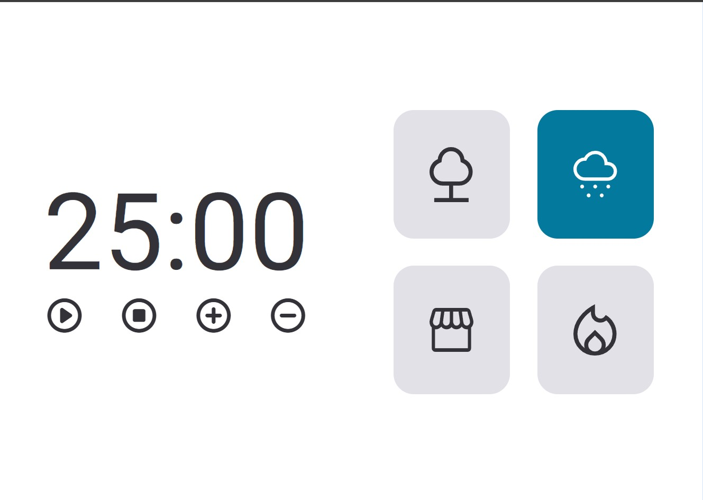

<h1 align="center"> Explorer - Stage 06 - Focus Timer 2.0 - Desafio</h1>

Projeto para a formação Fullstack da Rocketseat para ensino de tecnologias WEB.  
<a href="https://www.rocketseat.com.br/formacao/fullstack?utm_source=github&utm_medium=eexplorer-projeto-14-focus-timer-2.0&utm_campaign=capture-explorer&utm_term=organic&utm_content=descricao-github-rogeriolins">Faça essa formação em vídeo clicando aqui.</a>

  <a href="#-tecnologias">Tecnologias</a>&nbsp;&nbsp;&nbsp;|&nbsp;&nbsp;&nbsp;
  <a href="#-projeto">Projeto</a>&nbsp;&nbsp;&nbsp;|&nbsp;&nbsp;&nbsp;
  <a href="#-layout">Layout</a>&nbsp;&nbsp;&nbsp;|&nbsp;&nbsp;&nbsp;
  <a href="#memo-licença">Licença</a>

  

 

  

## 🚀 Tecnologias

Esse projeto foi desenvolvido com as seguintes tecnologias:

- HTML e CSS
- Git e Github
- JavaScript

## 💻 Projeto

Proposto 14 - tem as seguintes finalidades:

O Focus timer 2.0 é um contador que ajuda a focar em uma tarefa sem interrupção por um determinado tempo, podendo selecionar até 4 sons de ambiente e adicionar 5 minutos ate o limite de 60 minutos ou diminuir ate 5 minutos, abaixo disso ele diminui de 1 em 1 minuto com o minimo de 59s.

- [Acesse o projeto finalizado, online](https://rogeriolins.github.io/explorer-projeto14-desafio-focus-timer-2.0)

- [Assistir aulas](https://www.rocketseat.com.br/formacao/fullstack?utm_source=github&utm_medium=explorer-projeto-14-focus-timer-2.0&utm_campaign=capture-explorer&utm_term=organic&utm_content=descricao-github-rogeriolins)

## 🔖 Layout

Você pode visualizar o layout do projeto ao se matricular na formação.

## :memo: Licença

Esse projeto está sob a licença MIT.

---

Feito com ♥ by Rocketseat e codado por [Rogerio Lins](https://instagram.com/rogeriolins.dev) :wave: [Participe da nossa comunidade!](https://discord.gg/rocketseat)
